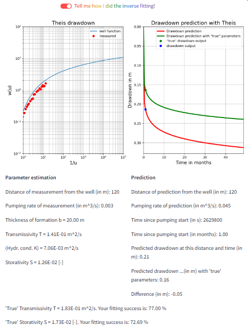

# Streamlit Apps

The content of selected Jupyter Notebooks is available as Streamlit App. These interactive applications are very user friendly. The can be accessed by computer and mobile devices. Feel free to explore the iNUX Streamlit apps that are presented in the subsequent folders.

## Featured App
### Transient flow to wells - Parameter estimation and drawdown prediction with the Theis solution

The [app](https://theis-inverse-drawdown-random.streamlit.app/) allow to use random data with measurement noise. In a first step, the formation parameters transmissivity _T_ and storativity _S_ are determined. Subsequently, the parameter can be used for a prediction of drawdown. The app compares the results with the 'true' parameters to those fitted by the user. Accordingly, prediction uncertainty can be investigated. 

You can access the app here [https://theis-inverse-drawdown-random.streamlit.app/](https://theis-inverse-drawdown-random.streamlit.app/)

## All Apps 
Browse through this webpage to explore more apps. All apps are also shown here [https://share.streamlit.io/user/thoreimann](https://share.streamlit.io/user/thoreimann) (although not categorized/sorted).
