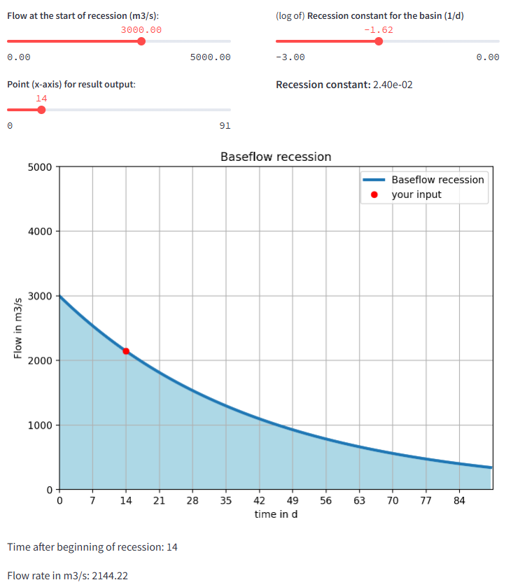
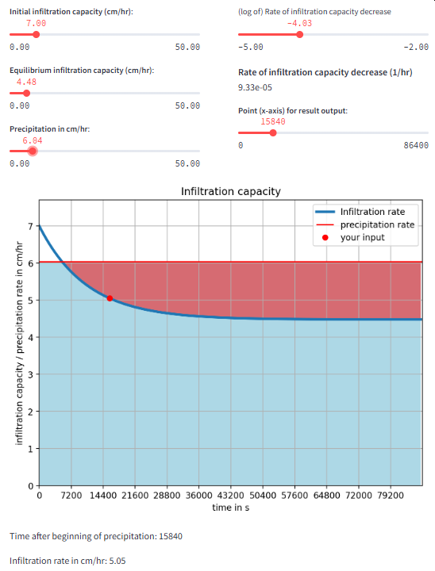

#### Streamlit Apps for the topic

# 02 Basic Hydrology

## Baseflow recession
This [**app**](https://baseflow-recession.streamlit.app/) computes the capture zone for an abstraction well in a confined aquifer. The user can modify parameters like pumping rate _Q_, hydraulic conductivity _K_, and more to investigate the effect on the shape of the capture zone.

You can **access the app** here: [https://baseflow-recession.streamlit.app/](https://baseflow-recession.streamlit.app/)

## Infiltration Capacity
This [**app**](https://infiltration-capacity.streamlit.app/) computes the amount of infiltration over time. The user can modify parameters like infiltration coefficient, precipitation rate, and more to investigate the amount of precipitation that infiltrates vs. the exceeding precipitation (runoff).

You can **access the app** here: [https://infiltration-capacity.streamlit.app/](https://infiltration-capacity.streamlit.app/)