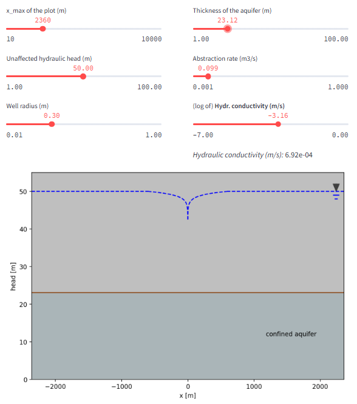
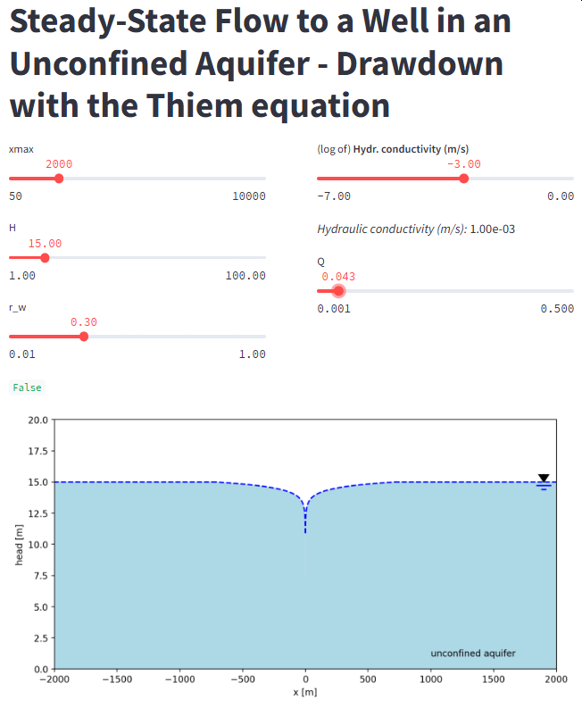

#### Streamlit Apps for the topic
### 04 Basic Hydrogeology
# Flow to wells 

## Well capture zone
This [**app**](https://well-capture-zone.streamlit.app/) computes the capture zone for an abstraction well in a confined aquifer. The user can modify parameters like pumping rate _Q_, hydraulic conductivity _K_, and more to investigate the effect on the shape of the capture zone.

You can **access the app** here: [https://well-capture-zone.streamlit.app/](https://well-capture-zone.streamlit.app/)

## Steady state flow to a well in a confined aquifer (Thiem solution)
This [**app**](https://flow2well-thiem-confined.streamlit.app/) computes the steady state flow to a well in a confined aquifer by using the Thiem equation. The user can modify parameters like pumping rate _Q_, hydraulic conductivity _K_, and more to investigate the effect on the cone of drawdown.

You can **access the app** here: [https://flow2well-thiem-confined.streamlit.app/](https://flow2well-thiem-confined.streamlit.app/)

## Steady state flow to a well in an unconfined aquifer (Thiem solution)
This [**app**](https://flow2well-thiem-unconfined.streamlit.app/) computes the capture zone for an abstraction well in an unconfined aquifer. The user can modify parameters like pumping rate _Q_, hydraulic conductivity _K_, and more to investigate the effect on the shape of the capture zone.

You can **access the app** here: [https://flow2well-thiem-unconfined.streamlit.app/](https://flow2well-thiem-unconfined.streamlit.app/)