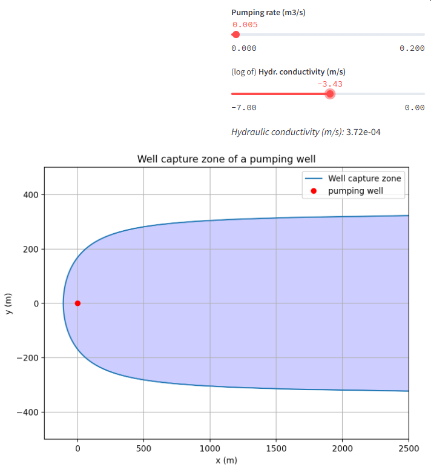

### Streamlit Apps for the topic

## 04 Basic Hydrogeology

# Flow to wells 

### Well capture zone

This [app](https://well-capture-zone.streamlit.app/) computes the capture zone for an abstraction well in a confined aquifer. The user can modify parameters like pumping rate _Q_, hydraulic conductivity _K_, and more to investigate the effect on the shape of the capture zone.

You can access the app here: [https://well-capture-zone.streamlit.app/](https://well-capture-zone.streamlit.app/)

