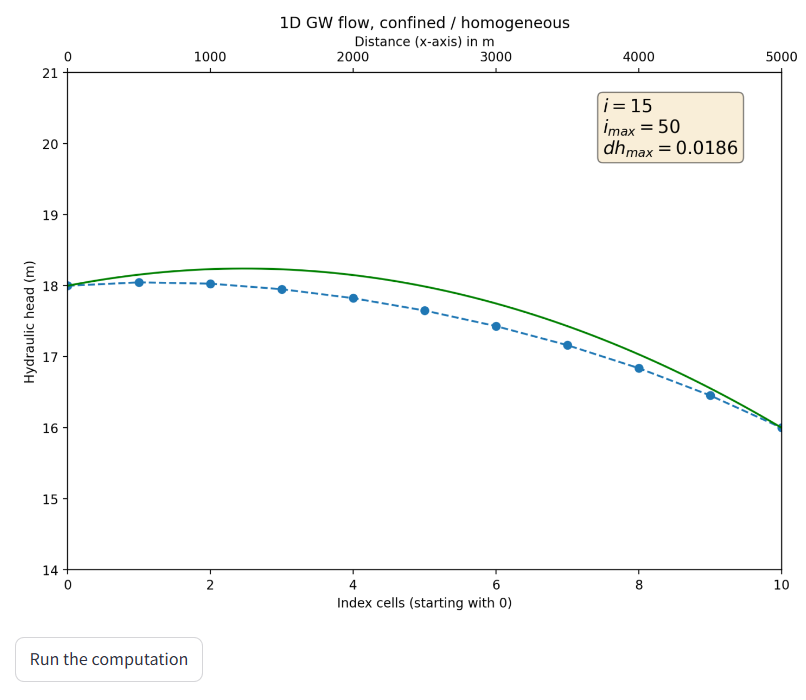

### Streamlit Apps for the topic

# 06 Groundwater Modeling

## Finite Difference solution for 1D confined flow with recharge
This [**app**](https://gwf-1d-conf-fd.streamlit.app/) computes the 1D groundwater flow in a confined aquifer with recharge by using a Finite Difference scheme. The user can modify the parameter for the groundwater flow scenario as well as for the numerical solution. Results from the numerical solution can be compared with an analytical solution.

You can **access the app** here: [https://gwf-1d-conf-fd.streamlit.app/](https://gwf-1d-conf-fd.streamlit.app/)