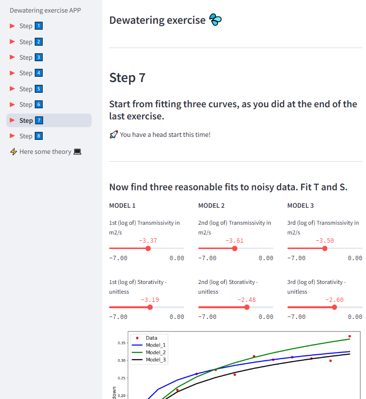
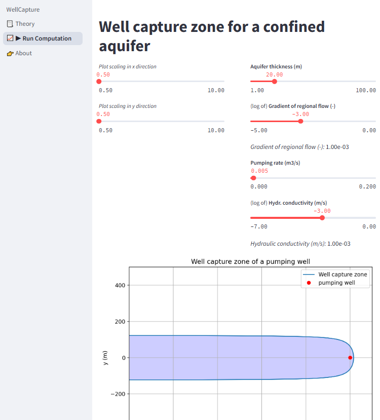

# Multipage Streamlit Apps for different topics

Here you can find more complex multipage apps that combine individual apps. Multipage apps are suitable tools for individual learning, excercises, and assignments.

## Dewatering exercise

This [**multipage app**](https://dewatering-exercise-app.streamlit.app/), developed by Ty Ferre, is a complete exercise for mine dewatering. It is based on the apps for transient flow to wells with the Theis solution.

You can **access the multipage app** here: [https://dewatering-exercise-app.streamlit.app/](https://dewatering-exercise-app.streamlit.app/)

## WellCapture ([The Groundwater Project](https://gw-project.org/))

This [**multipage app**](https://gwp-wellcapture.streamlit.app/) is an interactive tool to investigate the well capture zone. It is based on the app for the well catchment.

You can **access the multipage app** here: [https://gwp-wellcapture.streamlit.app/](https://gwp-wellcapture.streamlit.app/)