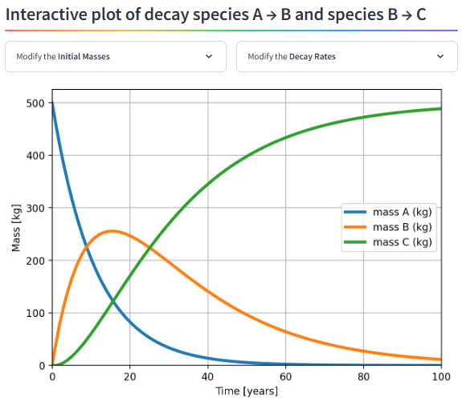

#  **The iNUX PROJECT**

***Interactive Understanding of Groundwater Hydrology and Hydrogeology***

*An ERASMUS+ cooperation project*

## Overview

Welcome to the iNUX catalog of interactive documents.

Groundwater and its associated processes are critically important but largely invisible. The iNUX project develops interactive and digital learning materials that complement existing teaching approaches by making groundwater and its associated processes more visible and accessible through dynamic visualizations and hands-on exploration.

These resources are intended to support educators and learners in understanding, applying, explaining, communicating, and teaching concepts of fundamental and applied hydrogeology.

All materials are freely available under the CC-BY-SA 4.0 open-source license.

## 🚀 Quick Access to Resources

The iNUX catalog provides several complementary ways to explore interactive learning materials, depending on the intended depth of use and technical setting.

For immediate, browser-based access, Streamlit apps offer the most direct entry point and require no local installation, while additional formats are listed in the table below.

| Resource Type | Description | Access Point |
| :--- | :--- | :--- |
| **Streamlit Apps** | User-friendly, web-based applications for platform-independent, interactive exploration. | • Links to the  Streamlit apps are directly integrated into this catalog |
| **Jupyter Notebooks** | Combinations of text, explanations, and live Python code for computation and in-depth analysis. | • Download the IPYNB documents for local use   <a href="https://mybinder.org/v2/gh/gw-inux/Jupyter-Notebooks/HEAD?urlpath=tree" target="_blank" rel="noopener noreferrer"><strong>• Launch Binder</strong></a> <strong>(Online Access)</strong> |
| **Full Repository** | Access all source code, videos, questions, and problem sets, organized by hydrogeological topic. | <a href="https://github.com/gw-inux/Jupyter-Notebooks/" target="_blank" rel="noopener noreferrer"><strong>Visit GitHub Repository</strong></a> |

---

## Featured Interactive Tool: Radioactive Decay App

Get started immediately with a powerful simulation tool.

**Purpose:** Investigate the mass balance for substances undergoing decay. Define initial mass and decay rates for three components to analyze their mass balance over time.

**Access:** <a href="https://radioactive-decay.streamlit.app/" target="_blank" rel="noopener noreferrer"><strong>Radioactive Decay App</strong></a>

---

<table style="width:100%; border-collapse:collapse; border:none; margin-top:2rem;">
  <tr>
    <td style="width:220px; border:none; vertical-align:middle; padding:0;">
      
    </td>
    <td style="border:none; vertical-align:middle; padding-left:1rem; font-size:0.95rem; line-height:1.35;">
      This project is co-funded by the European Union. However, the views and opinions expressed are solely those of the author(s) and do not necessarily reflect those of the European Union or the National Agency DAAD. Neither the European Union nor the granting authority can be held responsible for them.
    </td>
  </tr>
</table>

