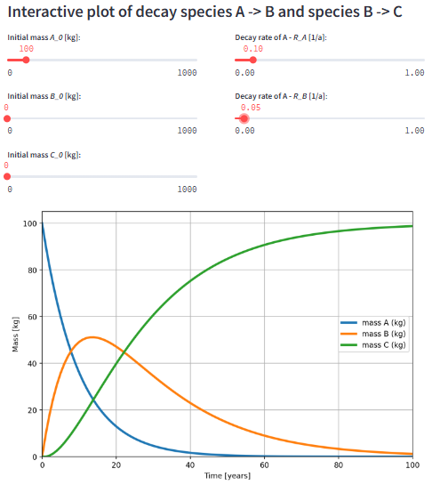

# General information about the iNUX Interactive Documentssss

## Welcome and quick access

This webproject presents a wide range of Jupyter Notebooks and Streamlit apps to support education in groundwater management and hydrogeology.

Various existing interactive documents are available through the [GitHub repository](https://github.com/gw-inux/Jupyter-Notebooks/). Jupyter Notebooks and Streamlit apps are used through a webbrowser on your computer or any other device (e.g., mobile phone and tablet).

**Featured Streamlit App for your initial trial:** [**Radioactive Decay**](https://radioactive-decay.streamlit.app/)

The [**app**](https://radioactive-decay.streamlit.app/) allow to use investigate the mass balance for three substances that can decay. The user can define the initial mass and the decay rate of three substances. This allows to investigate the mass balance. 

You can access the app here [https://radioactive-decay.streamlit.app/](https://radioactive-decay.streamlit.app/)

## Streamlit Apps

Streamlit Apps are very user friendly apps that allow to access the interactive documents plattformindependent.

A range of the interactive documents is accessible through [Streamlit Apps](https://share.streamlit.io/user/thoreimann). An overview about the Streamlit apps is provided [in the Streamlit submenu](https://gw-inux.github.io/Jupyter-Notebooks/Streamlit.html) of this webpage.

## Jupyter Notebooks

Jupyter Notebooks allow to access the interactive documents. They can combine text and explanations with Python computations. The provide a high degree of freedow, and they potentially allow immediate individiual modifications.

### Online Access
You can access and process the Jupyter Notebooks **online** by, for example, the MyBinder service through [**THIS LINK**](https://mybinder.org/v2/gh/gw-inux/Jupyter-Notebooks/HEAD?urlpath=tree). More specific links are provided in the _Courses and Projects_ part of this page. This also presents a suitable way of combining a selection of Jupyter Notebooks from the repository for a specific use case (e.g., as accompanying material for a course). _More information and discussion of ways to execute Jupyter Notebooks are available, for example in an [overview from Dmitry Soshnikov](https://soshnikov.com/education/how-to-execute-notebooks-from-github/).

_**Please be aware** that accessing and executing the Jupyter Notebooks through the **MyBinder Service can take some time to start** the server. Usually, the first start takes longer because MyBinder needs to set up a server with a specific installation for you. Subsequent starts (in the following minutes) should be faster. Sometimes, when accessing the Jupyter Notebook as Voila-Dashboard, it can be useful to reload the page in case the process seems to be stuck. [Some more information here](https://discourse.jupyter.org/t/how-to-reduce-mybinder-org-repository-startup-time/4956)_ 

### Local Access (offline)
Alternatively, you can download the Jupyter Notebooks and work with them **locally** on your own. The required steps for setting up your device for local working with Jupyter Notebooks are described for example in the iNUX Handbook. Typically, you have to install Python and Jupyter Notebook. A convenient distribution of the most required software is [Anaconda](https://www.anaconda.com/).

## Your contributioon

Further contributions are very welcome (e.g., using the [Incoming](https://github.com/gw-inux/Jupyter-Notebooks/tree/main/99%20INCOMING) section in the repository).
