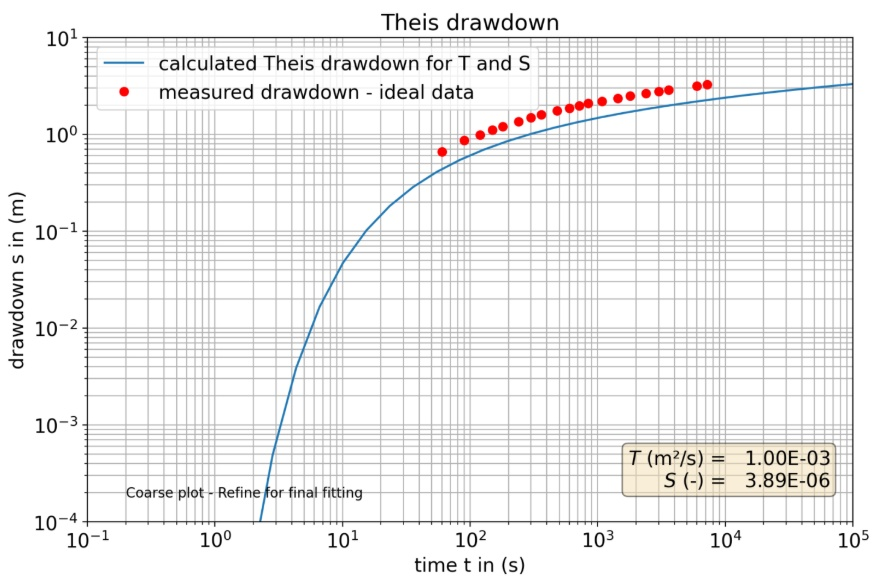
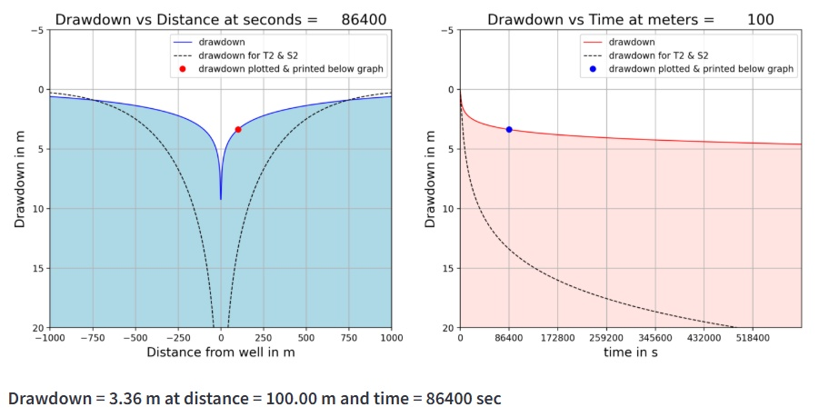

<!-- page_id: 060400_en -->
<!-- parent_id: 060000_en -->
<!-- lang_code: en -->

# Aquifer Testing

No introductory content yet.

<!--INJECT_RESOURCE_LIST_HERE-->

## Interactive Resources (Aquifer Testing)

## The Pumping Test Module

**Type:** Streamlit app | **Time:** 2 hours

Pumping tests are one of the most important methods for acquiring information about groundwater systems. A pumping test provides values of aquifer transmissivity T and storativity S and in some settings, other hydraulic parameter values. This module is designed to introduce the evaluation of pumping tests for confined, unconfined, and leaky aquifers. The Pumping Test Analysis Module is provided by The Groundwater Project and developed in  cooperation with the iNUX project. The module forms part of a broader initiative to create interactive, open-access educational resources for groundwater science and engineering.
Overview of the module: This module combines theoretical explanations with interactive applications and exercises. Quizzes inside the module allow you to assess your understanding. The underlying theory is provided as a concise overview at the beginning. First, the general response of aquifers to groundwater abstraction is explained as a cone of water-level drawdown expanding outward from a well over time. Then we explore how pumping test data can be evaluated to estimate hydraulic parameters such as transmissivity and storativity for: confined, leaky, and unconfined aquifers. Opportunities are offered to explore the evaluation methods with a few different synthetic and idealized data that originate from textbooks, as well as measured data from the Varnum test site in Sweden, the Viterbo test site in Italy, the Pirna test site in Germany, and you can also use your own data in the Pumping Test Analysis section.

[**LAUNCH RESOURCE**](https://gwp-pumping-test-analysis.streamlit.app/)

| Detail | Value |
| :--- | :--- |
| **URL** | [https://gwp-pumping-test-analysis.streamlit.app/](https://gwp-pumping-test-analysis.streamlit.app/) |
| **Author(s)** | Thomas Reimann (TU Dresden); Eileen Poeter (Colorado School of Mines) |
| **Keywords** | Theis, Neuman, Hantush-Jacob, Pumping test |
| **Fit For** | self learning, exam preparation |
| **Prerequisites** | Basic Hydrogeology |
| **References** | https://zenodo.org/records/16789736 |

### Streamlit app details

| Detail | Value |
| :--- | :--- |
| Multipage app | yes |
| Number of pages | 7 |
| Interactive plots | yes |
| Number of interactive plots | 10 |
| Assessments included | yes |
| Number of assessment questions | 28 |
| Videos included | yes |
| Number of videos | 1 |

### Images

*An applied exercise with the Pumping Test Analysis Module - Theis curve fitting with random data and prediction. (Screenshot)*

*Prediction of drawdown with Theis. Evaluation of different datasets (Screenshot)*

---

