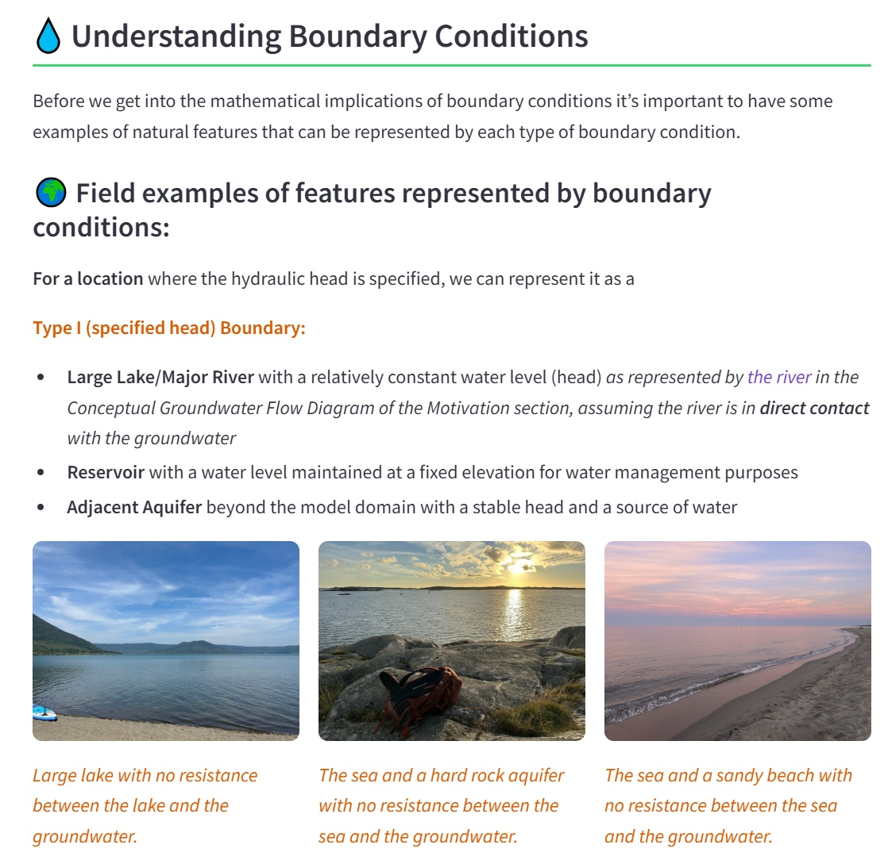

<!-- page_id: 080100_en -->
<!-- parent_id: 080000_en -->
<!-- lang_code: en -->

# Conceptual Model Development

No introductory content yet.

<!--INJECT_RESOURCE_LIST_HERE-->

## Interactive Resources (Conceptual Model Development)

## Introduction in Boundary Conditions

**Type:** Streamlit app | **Time:** 30–45 minutes

Boundary conditions define how the groundwater system interacts with its surroundings. They describe whether water enters or leaves the model domain, for example, through recharge, rivers, lakes, wells, or impermeable barriers. It is essential to understand the concept behind the different boundary conditions. This understanding is required to ‘translate’ physical and hydrological elements of the real world into model elements.
With this application you can build intuition for how Type I/II/III boundaries behave, and how this behavior can be described by discharge-head relations (Q–h-plots). You can learn how boundary conditions reflect system characteristics, and gain an understanding of the general characteristics of groundwater–surface water interaction.
This application is an excellent introduction for the Module: Boundary Conditions for Groundwater Modeling.

[**LAUNCH RESOURCE**](https://gwp-boundary-conditions-intro.streamlit.app/)

| Detail | Value |
| :--- | :--- |
| **URL** | [https://gwp-boundary-conditions-intro.streamlit.app/](https://gwp-boundary-conditions-intro.streamlit.app/) |
| **Author(s)** | Thomas Reimann (TU Dresden); Eileen Poeter (Colorado School of Mines) |
| **Keywords** | Boundary conditions, groundwater modeling, conceptual model |
| **Fit For** | self learning, classroom teaching, online teaching |
| **Prerequisites** | Basic hydrogeology |

### Streamlit app details

| Detail | Value |
| :--- | :--- |
| Multipage app | no |
| Number of pages | — |
| Interactive plots | yes |
| Number of interactive plots | 4 |
| Assessments included | yes |
| Number of assessment questions | 8 |
| Videos included | no |
| Number of videos | — |

### Images

*Insight of the app that combines explanations, figures, interactive plots, and assessments. (Screenshot)*

---

